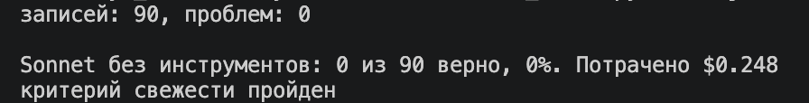
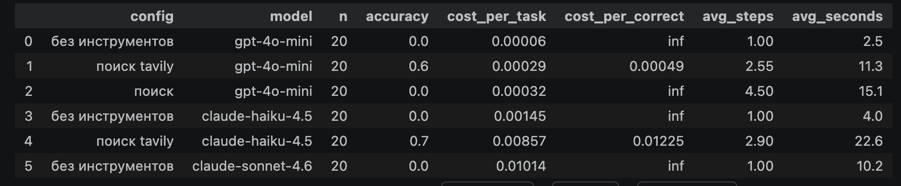

Тема набора календарь выхода треков исполнителей. Источник genius.com.
Собирал скраппингом web-страницы с помощью bs4.

В замере посчитал на 20 записях, так как много трат на дорогую модель
Ниже итоговая таблица и картинки

Тезис курса подтвердился тем, что ни одна модель не знала этой информации, а написание tools открыло доступ.

Провалы   traces/поиск_tavily (fresh-2,fresh-4)
fresh-2:
gpt-4о-mini взял не нашел
claude-haiku-4.5 перепытал дату с количеством треков(возможно надо промпт доработать)
fresh-4:
gpt-4о-mini взял не ту информацию

Дополнительно, что делал:
1. Пометил HW что добавил + комментарии в ноутбуке(если кратко: генерация датасета, изменил системный промпт+ tavily, добавил в замере ограничение 1 шаг для strong модели).

Не понял, как в каскаде вызвать tool, так как ask_structed не имеет этого функционала.
