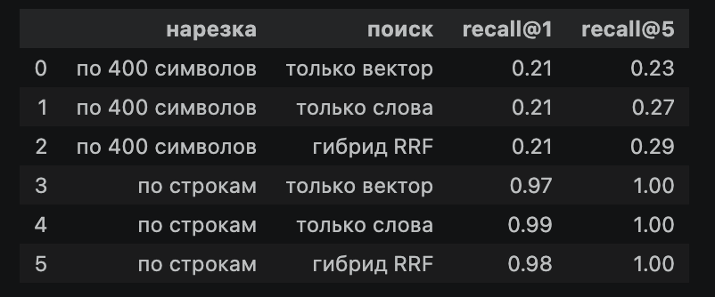
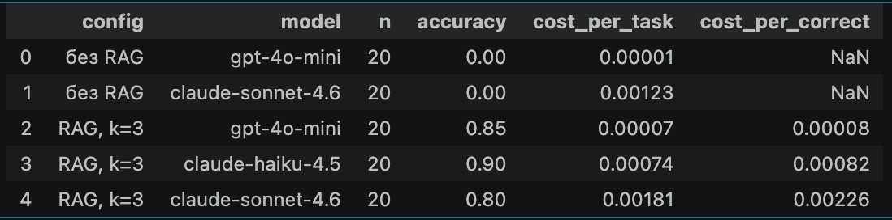
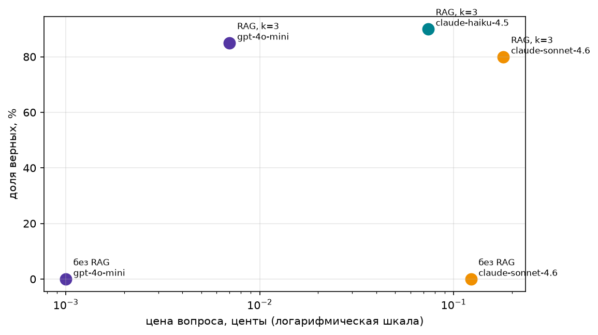
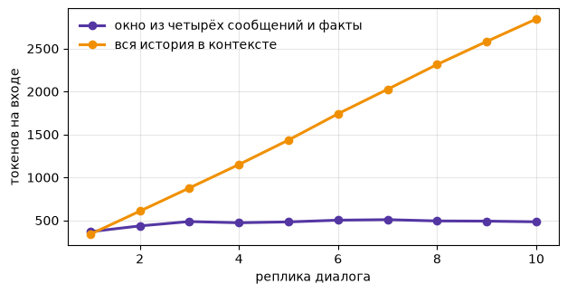

Тема набора календарь выхода треков исполнителей. Источник genius.com.
Собирал скраппингом web-страницы с помощью bs4.
Резал по дате, обогощая чанк, так как если построчно, то теряется дата.

Тезис курса подтвердился тем, что экономится контекстное окно. Не храним все, а используем релевантные чанки.

Провалы  были связаны с форматом вывода и Not Found.

Не понял, как вызвать tools с прошлого урока.
